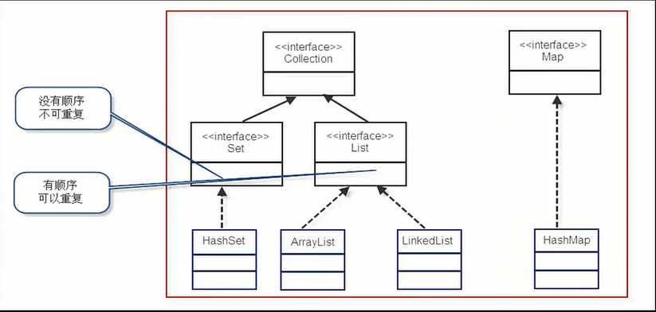
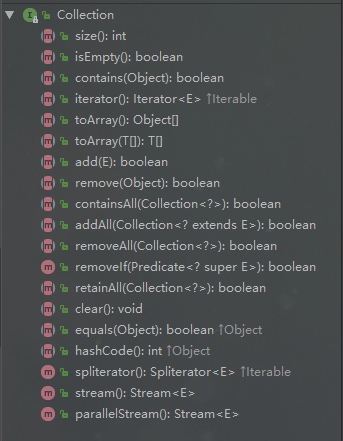
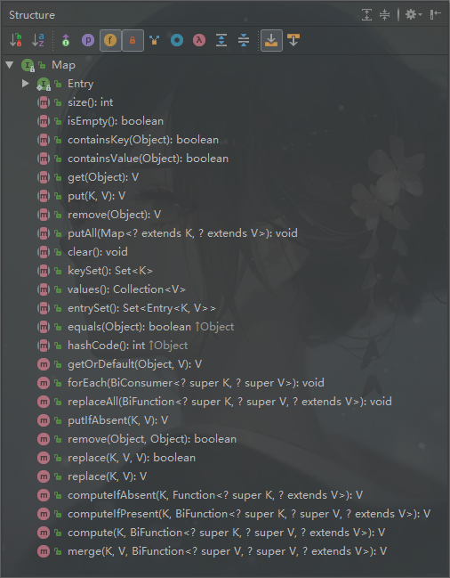

## 容器/集合

### 1.Collection

Collection：容器，集合。

子接口List可以重复，有顺序；Set不可重复，无顺序。



### 2.Collection接口方法

List和Set作为Collection的子接口，继承Collection的所有方法。



### 3.List接口的实现类

ArrayList：数组实现，适合随机查找和遍历，不适合插入和删除。

LinkList：链表结构，适合数据的动态插入和删除，随机访问和遍历速度比较
慢。

Vector：数组实现，保证了线程同步

接口方法：


### 4.Map接口

​	存储键值对，key-value形式，键不可重复。

接口方法：



### 5.使用迭代器Iterator遍历集合

#### 遍历List

```java
List<String> list = new ArrayList<>();
//add elements ...
for(Iterator<String> iter=list.iterator();iter.hasNext();{
    String temp = iter.next();
    System.out.println(temp);
}
```

#### 遍历Map

第一种方式：

```java
Map<Integer,String> map = new HashMap<>();
//put elements ...
Set<Entry<Integer,String>> ss = map.entrySet();
for(Iterator<Entry<Integer,String>> iter=ss.iterator();iter.hasNext();){
	Entry<Integer,String> temp = iter.next();
    System.out.println(temp.getKey()+":"+temp.getValue());
}
```

第二种方式：

```java
Map<Integer,String> map = new HashMap<>();
Set<Integer> keySet = map.keySet();
for(Iterator<Integer> iter = keySet.iterator();iter.hasNext();)[{
    Integer key = iter.next();
    System.out.println(key+":"+map.get(key));
}
```

#### 遍历Set

```java
Set<String> set = new HashSet<>();
//add elements ...
for(Iterator<String> iter=set.iterator();iter.hasNext();{
    String temp = iter.next();
    System.out.println(temp);
}
```

## 多线程

### 1.创建线程常用的两种方法

#### 继承Thread类

```java
package com.tassel.thread;

/**
 * 实现线程的第一种方法 继承Thread类,重写run()方法,调用start()方法.
 */
public class MyThread extends Thread {

	@Override
	public void run() {
		for (int i = 0; i < 10; i++) {
			System.out.println(i + "---唱跳rap篮球");
		}
	}

	public static void main(String[] args) {
		MyThread myThread = new MyThread();
		myThread.start();

		for (int i = 0; i < 10; i++) {
			System.out.println(i + "---music!");
		}
	}
}
```

#### 实现Runable接口

```java
package com.tassel.thread;

/**
 * 实现线程的第二种方法：实现Runable接口,重写run()方法.
 */
public class MyRunable implements Runnable {

	@Override
	public void run() {
		for (int i = 0; i < 10; i++) {
			System.out.println(i + "---music!");
		}
	}

	public static void main(String[] args) {
//		new Thread(new MyRunable()).start();
		MyRunable myRunable = new MyRunable();
		Thread thread = new Thread(myRunable);
		thread.start();
		
		for (int i = 0; i < 10; i++) {
			System.out.println(i + "---唱跳rap篮球");
		}
	}
}
```

