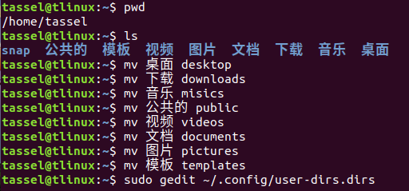
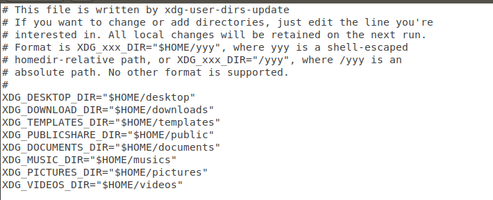
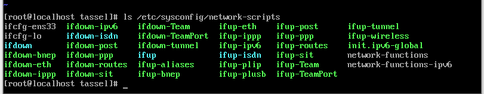
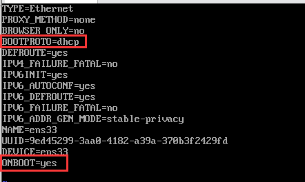

## 1.修改/home目录下的中文目录为英文

1. 修改目录名

   ```
   mv 桌面 desktop
   mv 下载 downloads
   mv 音乐 musics
   mv 公共的 public
   mv 视频 videos
   mv 文档 documents
   mv 图片 pictures
   mv 模板 templates
   ```

2. 修改配置文件

   ```
   sudo gedit ～/.config/user-dirs.dirs
   ```

   sudo 提供root读写权限.

   之后会进入编辑界面，将配置文件中的文件名字修改为第一步修改的文件名即可.





## 2.centos安装gcc 之前的无法上网问题

* 管理员身份输入命令：`ls /etc/sysconfig/network-scripts`

  

* 输入命令：`vi /etc/sysconfig/network-scripts/ifcfg-ens33`

* 进入编辑界面后按`i` 进入编辑模式

* 修改`BOOTPROTO=dhcp，ONBOOT=yes`

  

* 修改完成后 先按Esc键，再输入冒号（：），然后输入wq，最后按回车键方可退出vim编辑器

* 最后输入命令：`service network restart`

* 安装gcc：`yum install gcc -y`

## 3.Xshell 远程连接

1. 找到主机ip：`ip addr`  or  `ifconfig`
2. 在Xshell中新建连接输入主机ip和端口号
3. 输入用户名和密码

## 4.ifconfig命令找不到问题

1. 首先判断一下是不是缺少了ifconfig，它是在/sbin目录下·

   `cd /sbin`

   `ls`查看是否有ifconfig

2. 没有的话 安装net-tools package

   `yum -y install net-tools`

## 5.Tomcat启动成功后无法访问的问题

原因：centos7系统防火墙拦截了Tomcat访问的8080端口

解决方案1：关闭防火墙（可能导致系统不安全）

解决方案2：开放centos7防火墙的端口

```
##Add 
firewall-cmd --permanent --zone=public --add-port=8080/tcp 
##Reload 
firewall-cmd --reload 
##检查是否生效 
firewall-cmd --zone=public --query-port=8080/tcp
```

生效后，重启tomcat即可访问。

## 6.vim制表符长度改为4个空格

首先需要管理员权限

打开vim的配置文件

​	`vim /etc/vimrc`

在最后加入

```
set ts=4
set autoindent
set softtabstop=4
set shiftwidth=4
set expandtab
```

