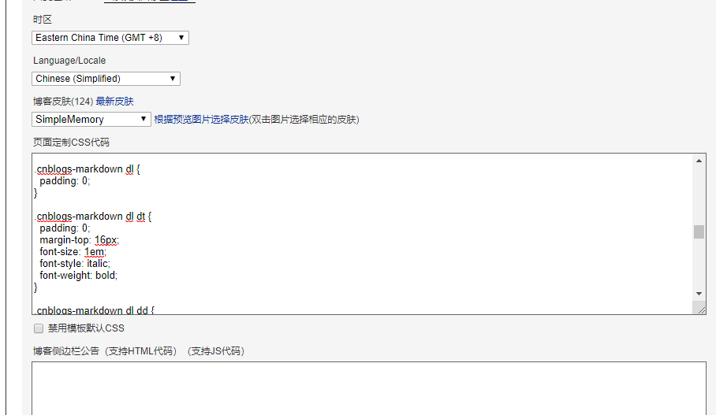

# 博客园-换主题

# 第二个尝试

第一次已备份，直接开始

地址：  https://github.com/confidentFeng/cnblogs__theme 

博客园皮肤模板：Custom，禁用模板默认CSS

### 页面定制css代码

```css
/* 博客主体部分 begin */
* {
    margin: 0;
    padding: 0;
}

html {
    height: 100%;
}

body {
    background: #e0ebe8;
    color: #404244;
    font-family: Arial,Helvetica,sans-serif,-apple-system, BlinkMacSystemFont, 'Segoe UI', Roboto, Oxygen, Ubuntu, Cantarell, 'Open Sans', 'Helvetica Neue'; 
    font-size: 16px;
}

/* 按钮等控件鼠标样式设置为手指箭头 */
button, html input[type="button"], input[type="reset"], input[type="submit"] {
    -webkit-appearance: button;
    cursor: pointer;
}

/* 图像 */
img {
    vertical-align: middle;
    border: 0;
}

*, :before, :after {
    -webkit-box-sizing: border-box;
    -moz-box-sizing: border-box;
    box-sizing: border-box;
    position: relative;
}

li {
    list-style: none outside none;
}

a:link, a:visited {
    color: #327a9c;
    text-decoration: none;
}

a:hover, a:active {
    color: #f76160;
    text-decoration: none;
}

#main {
    overflow: hidden;
    padding: 20px 24px 10px 24px;
}

/* 主内容栏 */
#mainContent {
    float: right;
    margin-left: -210px;
    min-height: 200px;
    text-overflow: ellipsis;
    width: 100%;
    word-break: break-all;
}

/* 右边内容部分 */
#mainContent .forFlow {
    margin-left: 216px;
    width: auto;
}

/* 每天的文章 */
.day {
    background: #ffffff;
    border-radius: 7px;
    min-height: 10px;
    margin-bottom: 14px;
    padding: 8px 15px 8px;
}

/* 文章摘要 */
.postCon {
    clear: both;
    padding: 10px 0 8px;
}

/* 文章右下角 */
.postDesc {
    clear: both;
    float: right;
    text-align: right;
}

/* --底部 下一页 begin-- */
.topicListFooter {
    text-align: left;
}

#nav_next_page a {
    background: #217d68;
    border: 0;
    color: #fff;
    border-radius: 5px;
    padding: 5px 11px;
    display: inline-block;
}
/* --底部 下一页 end-- */

/* --页脚版权部分 begin-- */
#footer {
    background: #c5ded7;
    text-align: center;
    color: #217d68;
    padding: 2em 0;
    margin-top: 12px;
}
/* --页脚版权部分 end-- */
/* 博客主体部分 end */


/* 侧边栏 begin */
/* 公告 */
.newsItem {
    background: #fafcfd; /* 灰白色 */
    border-radius: 7px;
    margin-bottom: 15px;
    padding: 0.4em;
}

/* 搜索 */
.div_my_zzk
{
    margin-left: 5px;
    margin-right: 5px;
    display: flex;
}

/* 搜索输入框 */
.input_my_zzk {
    height: 30px;
    border: 1px solid #319c84;
    background: #eee;
    font-size: 16px;
    padding: 0 5px;
    -webkit-appearance: none;
    flex: 1;
}

/* 搜索栏焦点 */
.input_my_zzk:focus {
    outline: none;
}

/* 搜索按钮 */
input.btn_my_zzk {
    width: 70px;
    height: 30px;
    font-size: 14px;
    color: #fff;
    border: none;
    background: #319c84;
    border-radius: 3px;
}

/* 侧边栏每个块-名称部分 */
.catListTitle {
    background: #319c84;
    border-top-left-radius: 7px;
    border-top-right-radius: 7px;
    color: #ffffff;
    font-size: 1.0em;
    line-height: 1.5em;
    padding: 3px 4px 0px;
    text-indent: 0.5em;
}

/* 整个侧边栏（包括公告、随笔分类等） */
@media (min-width: 768px) {
    #sideBar {
        float: left;
        overflow: hidden;
        text-overflow: ellipsis;
        width: 200px;
    }
}

/* 侧边栏每个块 */
.sidebar-block {
    background: #fafcfd;
    border-top-left-radius: 7px;
    border-top-right-radius: 7px;
    margin-bottom: 15px;
    overflow: hidden;
}

/* 侧边栏每个“列表块”中的每一行 */
#blog-sidecolumn ul li{
    border-bottom: 1px solid #dadfe1;
    border-top: 1px solid #ffffff;
    overflow: hidden;
    padding: 4px 0.5em;
}

/* 随笔分类中的每一行 */
#sideBarMain ul {
    line-height: 1.5;
}

/* 随笔分类中的每一行中的文字 */
.catListPostCategory ul li a {
    font-size: 15px;
}

#sidebar_postcategory a:visited, #sidebar_postcategory a:link {
    color: #000;
    text-decoration: none;
}

.catListPostCategory ul li a:hover {
    text-decoration: none;
}

/* 取消显示一些“侧边栏窗口” */
#blogCalendar,  /* 日历 */
#blogTitle, /* 博客标题 */
#header,
/*#profile_block,  简介 */ 
#site_nav_under, /* 站点导航 */
.itnews, .c_ad_block, .dayTitle, .newsItem .catListTitle, 
#ad_t2, 
#commentbox_opt a, 
.gutter{
    display: none;
}
/* 侧边栏 end */


/* 文章主体 begin */
#topics {
    background: #fafafa;
    border-radius: 7px;
    overflow: hidden;
    text-overflow: ellipsis;
    word-break: break-all;
    padding: 10px 2px 10px 2px;
}

/* 文章列表中的文章标题 */
.day .postTitle {
    border-bottom: 1px solid #4ab19a;
    line-height: 0.6em;
    padding-top: 10px;
    padding-bottom: 10px;
    font-size: 1.4em;
}

/* 点开文章后的文章标题 begin */
#topics .postTitle {
    border-bottom: 1px solid #4ab19a;
    line-height: 1em;
    padding-left: 30px;
    padding-top: 3px;
    padding-bottom: 10px;
    font-size: 1.6em;
}

.postTitle a:link, .postTitle a:visited {
    color: #3e9c87;
    transition: all 0.4s linear 0s;
}

.postTitle a:hover, .postTitle a:active {
    color: #f76160;
    margin-left: 10px;
}
/* 点开文章后的文章标题 end */

.postBody {
    border-bottom: 1px solid #cccccc;
    padding-top: 10px;
    padding-left: 32px;
    padding-right: 32px;
}

#topics .postDesc {
    line-height: 2.5em;
    color: #666666;
    margin-top: 5px;
    padding-right: 5px;
    width: 100%;
}

#author_profile_detail a:link, #post_next_prev a:link {
    text-decoration: none;
}

/* 文章主体 end */


/* 点进某个随笔分类中 begin */
.entrylist {
    background: none repeat scroll 0 0 #ffffff;
    border-radius: 7px;
    box-shadow: 1px 1px 2px #a7a8ad;
    margin: 0 0 15px;
    min-height: 200px;
    overflow: hidden;
    text-overflow: ellipsis;
    word-break: break-all;
    padding: 15px 20px 12px;
}

/* 随笔分类大标题 */
.entrylistTitle, .PostListTitle {
    border-bottom: 1px solid #cccccc;
    padding-bottom: 3px;
    font-size: 20px;
}

.entrylistDescription {
    color: #666666;
    margin-bottom: 10px;
    padding-bottom: 5px;
    padding-right: 10px;
    padding-top: 5px;
    text-align: right;
}

.entrylistItem {
    margin-bottom: 20px;
    min-height: 20px;
}

.entrylistPosttitle {
    border-bottom: 1px solid #cccccc;
    font-size: 110%;
    font-weight: bold;
    line-height: 2em;
}

a.entrylistItemTitle {
    color: #3e9c87;
    font-size: 18px;
    line-height: 1.5em;
}

a.entrylistItemTitle:hover {
    color: #f76160;
}

.entrylistPostSummary {
    margin-bottom: 5px;
    margin-top: 5px;
}

.entrylistItemPostDesc {
    color: #666666;
    text-align: right;
}

.entrylistItemPostDesc a:link, .entrylistItemPostDesc a:visited, .entrylistItemPostDesc a:active {
    color: #666666;
}

.entrylistItemPostDesc a:hover {
    color: #f76160;
}
/* 点进某个随笔分类中 end */


/* 博客评论区域 begin */
div.commentform textarea.comment_textarea {
    outline: none;
    border: 1px solid rgba(0, 0, 0, .16);
    font-size: 15px;
    padding: 9px 13px;
    border-radius: 4px;
}

div.commentform textarea.comment_textarea:focus {
    border: 1px solid rgba(0, 128, 255, .5);
}

.feedback_area_title {
    line-height: 35px;
    margin: 1px 0 6px;
    font-size: 16px;
    padding-left: 8px;
}

.feedbackListSubtitle {
    color: #666666;
}

.feedbackListSubtitle a:hover {
    color: #f76160;
    text-decoration: none;
}

.feedbackManage {
    float: right;
    text-align: right;
    width: 200px;
}

.feedbackCon {
    background-size: 22px 22px;
    background-repeat: no-repeat no-repeat;
    background-position: 4px 4px;
    line-height: 1.5;
    min-height: 35px;
}

#divRefreshComments {
    font-size: 9pt;
    margin-right: 10px;
    text-align: right;
    margin-bottom: 10px;
    text-align: right;
}

.comment_btn {
    background: #319c84;
    border: none;
    color: #fff;
    font-size: inherit;
    border-radius: 5px;
}
/* 博客评论区域 end */


/* 其他 begin */
@media (max-width: 767px) {
    .newsItem {
        display: none;
    }

    #mainContent .forFlow {
        margin-left: 0;
    }

    #main {
        margin-top: 10px;
    }

    .day {
        margin-bottom: 8px;
    }
}

#AjaxHolder_PostComment_divCommnentArea {
    padding: 10px;
}

#AjaxHolder_PostComment_divCommnentArea td {
    padding: 5px 0;
}


.postDesc a:link, .postDesc a:visited, .postDesc a:active {
    color: #848484;
}

.postDesc a:hover {
    color: #f76160;
}

.commenttb {
    width: 320px;
}

.pager {
    color: #373834;
    font-size: 15px;
    margin-left: 20px;
    text-align: left;
}

.pager a {
    color: #fff;
    border: none;
    background-color: #217d68;
    border-radius: 5px;
    padding: 4px 8px;
}

.PostList {
    border-bottom: 1px solid #cccccc;
    clear: both;
    margin-bottom: 5px;
    min-height: 1.5em;
    padding-left: 5px;
    padding-right: 5px;
    padding-top: 10px;
}

.postTitl2 {
    float: left;
}

.postDesc2 {
    color: #666666;
    float: right;
}

.postText2 {
    clear: both;
    color: #666666;
}

.tdSentMessage {
    text-align: right;
}

.errorMessage {
    float: left;
    width: 300px;
}

#Profile1_panelAdd td {
    padding: 10px 0px;
}

.divPhoto {
    border: 1px solid #cccccc;
    margin-right: 10px;
    padding: 2px;
}

.thumbDescription {
    color: #666666;
    margin-bottom: 10px;
    padding-bottom: 5px;
    padding-right: 10px;
    padding-top: 5px;
    text-align: right;
}

.personInfo {
    margin-bottom: 20px;
}

.pages {
    text-align: right;
}

.postBody h2 {
    font-size: 150%;
    font-weight: bold;
    margin: 15px auto 2px;
}

.postBody a:link, .postBody a:visited, .postBody a:active {
    text-decoration: underline;
}

.postCon a:link, .postCon a:visited, .postCon a:active {
    text-decoration: underline;
}

.postBody ul, .postCon ul {
    margin-left: 2em;
}

.postBody li, .postCon li {
    font-size:16px;
    margin-bottom:12px;
}

.postBody p, .postCon p {
    font-size: 16px;
}

#cnblogs_post_body ol, #cnblogs_post_body ul {
    margin-left: 30px;
}

::selection {
    background: #409481;
    color: #fff;
}

#information {
    width: 70%;
    margin: auto;
    top: 300px;
    padding: 40px 0;
    font-size: 16px;
    background: rgba(230, 244, 249, .8);
    -webkit-animation: show-description 1s ease-out;
}

#information, #site-header {
    z-index: 1;
    text-align: center;
}

.c_b_p_desc_readmore {
    color: #915F5E;
    text-decoration: none;
}

.c_b_p_desc a:visited, .c_b_p_desc a:link {
    color: #217d68;
}
/* 其他 end */

/* 淡入动画 begin */
@-webkit-keyframes fadeIn {
    0% {
        opacity: 0
    }
    100% {
        opacity: 1
    }
}

@-moz-keyframes fadeIn {
    0% {
        opacity: 0
    }
    100% {
        opacity: 1
    }
}

@keyframes fadeIn {
    0% {
        opacity: 0
    }
    100% {
        opacity: 1
    }
}

.fade-area {
    -webkit-animation: fadeIn .5s ease-in-out;
    -moz-transition: fadeIn .5s ease-in-out;
    -o-transition: fadeIn .5s ease-in-out;
    transition: fadeIn .5s ease-in-out;
}
/* 淡入动画 end */

/* 一：begin */
section {
    display: block;
}

#top {
    padding-top: 0;
    overflow: hidden;
    background: #e0ebe8;
}

@media (min-width: 992px) {
    #top {
        /* padding-top: 130px; */
    }
}

header {
    padding: 1em 0;
    background: #e0ebe8;
}

header.nav-top {
    opacity: 1;
    position: relative;
    width: 100%;
    z-index: 1000;
    -webkit-transform: translate3d(0, 0, 0);
}

@media (min-width: 992px) {
    header.nav-top {
        opacity: 0;
        /* position: fixed; */
        -webkit-transform: translate3d(0, -130px, 0);
        -webkit-transition: .5s;
        transition: .5s;
        top: 0;
    }
}

@media (min-width: 992px) {
    header.headroom--unpinned {
        top: -200px;
    }
}

header.nav-fixed {
    opacity: 1;
    -webkit-box-shadow: none;
    box-shadow: none;
}

@media (min-width: 992px) {
    header.nav-fixed {
        -webkit-box-shadow: 0 1px 1px rgba(6, 8, 8, .1);
        box-shadow: 0 1px 1px rgba(6, 8, 8, .1);
        opacity: .97;
        -webkit-transition: all .8s;
        transition: all .8s;
        -webkit-backface-visibility: hidden;
        -webkit-perspective: 1000;
        overflow: hidden;
        -webkit-transition-timing-function: ease-in-out;
        -webkit-transform: translate3d(0, 0, 0);
        background: #fff;
    }
}

header.nav-root {
    background: inherit;
}

@media (min-width: 992px) {
    header.nav-root {
        background: #E0EBE8;
        -webkit-box-shadow: none;
        box-shadow: none;
        -webkit-transition: all .8s;
        transition: all .8s
    }
}

.transistion {
    -webkit-transition: all .5s ease-in-out;
    transition: all .5s ease-in-out;
}

.container {
    margin-right: auto;
    margin-left: auto;
    padding-left: 15px;
    padding-right: 15px;
}

@media (min-width: 768px) {
    .container {
        max-width: 750px;
    }
}

@media (min-width: 992px) {
    .container {
        max-width: 970px;
    }
}

@media (min-width: 1140px) {
    .container {
        max-width: 970px;
    }
}

.container {
    -webkit-transition: all .5s ease-in-out;
    transition: all .5s ease-in-out;
}

.row {
    margin-left: -15px;
    margin-right: -15px;
}

.row:before, .row:after {
    content: " ";
    display: table;
}

.row:after {
    clear: both;
}

.col-xs-4, .col-xs-8, .col-md-4, .col-md-8, .col-md-12 {
    position: relative;
    min-height: 1px;
    padding-left: 15px;
    padding-right: 15px;
}

.col-xs-4, .col-xs-8 {
    float: left;
}

.col-xs-4 {
    width: 33.33333333%;
}

.col-xs-8 {
    width: 66.66666667%;
}

@media (min-width: 992px) {
    .col-md-4, .col-md-8 {
        float: left;
    }
}

@media (min-width: 992px) {
    .col-md-4 {
        width: 33.33333333%;
    }
}

@media (min-width: 992px) {
    .col-md-12 {
        width: 100%;
    }
}

#header-logo {
    -webkit-animation: fadeIn .3s ease-in-out;
    -moz-transition: fadeIn .3s ease-in-out;
    -o-transition: fadeIn .3s ease-in-out;
    transition: fadeIn .3s ease-in-out;
    border-radius: 60px;
    overflow: hidden;
    width: 72px;
    height: 72px;
    position: relative;
    margin: 0;
    padding: 0;
}

.image-text {
    background-position: 0 0;
    background-repeat: no-repeat;
    display: block;
    overflow-x: hidden;
    overflow-y: hidden;
    text-indent: -9999px;
}

#header-logo span {
    display: block;
}

@media (min-width: 992px) {
    .col-md-8 {
        width: 66.66666667%;
    }
}

nav {
    display: block;
}

header .nav-list {
    padding-top: 1.5em;
    padding-left: 0;
    position: relative;
    float: right;
}

.nav-list li {
    display: block;
    float: left;
}

.nav-list li:first-child a {
    /* margin-left: 0; */
}

.nav-list li a:hover {
    color: #3e9c87;
}

.nav-list li a {
    text-decoration: none;
    color: #45b29a;
    font-weight: 400;
    margin: 0 0 0 1.5em;
    font-size: 100%;
    -webkit-transition: all .3s ease-in-out;
    transition: all .3s ease-in-out;
}

@media (min-width: 992px) {
    .nav-list li a {
        font-size: 120%;
        margin: 0 0 0 2em;
    }
}

.fa {
    margin-right: 0.4em;
}
/* 一：end */

/* 二：begin */
#title-area {
    padding: 1em 0;
}

@media (min-width: 992px) {
    #title-area {
        padding: 2.6em 0 3em;
    }
}

.llfc-blog {
    margin-top: 10px;
    margin-bottom: 20px;
}

h2 figure {
    max-width: 240px;
    margin: 0 auto;
    position: relative;
    z-index: 990;
}

@media (min-width: 992px) {
    h2 figure {
        max-width: 350px;
    }
}

h2 figure img {
    width: 100%;
    display: inline-block;
}

#title {
    padding: .5em 0 0;
    position: relative;
}

#title .container {
    position: relative;
}

#title .cloud {
    position: absolute;
    background: url(//images.cnblogs.com/cnblogs_com/hellovenus/610587/o_cloud.png) top left no-repeat;
    width: 150px;
    height: 45px;
    -webkit-transition: all 1s ease-in-out;
    transition: all 1s ease-in-out;
    z-index: 980;
}

#title .left-cloud {
    left: -6em;
    bottom: 2em;
}

@media (min-width: 992px) {
    #title .left-cloud {
        left: 2em;
        bottom: 3em;
    }
}

#title .right-cloud {
    right: -5em;
    top: 0;
}

@media (min-width: 992px) {
    #title .right-cloud {
        right: 2em;
        top: 6em;
    }
}
/* 二：end */

/* 三：begin */
#homepic {
    margin: 0 auto;
    max-width: 800px;
    overflow: hidden;
}

#homepic img {
    width: 100%;
    max-width: 800px !important;
}

/* 三：end */

#green_channel a {
    padding: 4px 5px;
    border-radius: 5px;
}


/* 博文内容 begin */
/* h1标题 */
#cnblogs_post_body h1 {
    font-size: 32px;
    margin-top: 26px;
    padding: 2px 10px;
    margin-bottom: 20px;
    border-left: 9px green solid;
}

/* h2标题 */
#cnblogs_post_body h2 {
    font-size: 28px;
    margin-top: 23px;
    padding: 2px 10px;
    margin-bottom: 17px;
    border-left: 7px green solid;
}

/* h3标题 */
#cnblogs_post_body h3 {
    font-size: 23px;
    margin-top: 20px;
    padding: 2px 10px;
    border-left: 5px green solid;
}

/* h4标题，用作信息提示 */
#cnblogs_post_body h4 {
    background: #e7f2fa;
    font-size: 16px;
    font-weight: normal;
    color: #333333;
    border: none;
    padding: 32px 10px 10px;
    margin-bottom: 10px;
}

#cnblogs_post_body h4:before
{
    content:'\f05a  提示';
    font-family: 'FontAwesome';
    background:#00a0d2;
    color:white;
    position:absolute;
    left:0;
    top:0;
    right: 0;
    clear:both;
    padding: 1px 7px;
}

/* h5标题，用作警告 */
#cnblogs_post_body h5 {
    background: #fffae5;
    font-size: 14px;
    font-weight: normal;
    color: #333333;
    border: none;
    padding: 32px 10px 10px;
    margin-bottom: 10px;
}

#cnblogs_post_body h5:before
{
    content:'\f071  警告';
    font-family: 'FontAwesome';
    background:#ffcc00;
    color:white;
    position:absolute;
    left:0;
    top:0;
    right: 0;
    clear:both;
    padding: 1px 7px;
}

/* h6标题，用作错误 */
#cnblogs_post_body h6 {
    background: #ffe9eb;
    font-size: 14px;
    font-weight: normal;
    color: #333333;
    border: none;
    padding: 32px 10px 10px;
    margin-bottom: 10px;
}

#cnblogs_post_body h6:before
{
    content:'\f06a  错误';
    font-family: 'FontAwesome';
    background:#ff4455;
    color:white;
    position:absolute;
    left:0;
    top:0;
    right: 0;
    clear:both;
    padding: 1px 7px;
}

/* 图片 */
#cnblogs_post_body img {
    box-shadow: 2px 2px 8px rgba(0, 0, 0, .7);
}
/* 段落 */
#cnblogs_post_body p {
    line-height: 1.4;
    font-size: 16px;
    margin-top: 10px;
}
/* 博客内容格式美化end */

.syntaxhighlighter table td.code .container
{
    padding:13px !important;
}
.syntaxhighlighter,.syntaxhighlighter .line.alt2,.syntaxhighlighter .line.alt1
{
    background-color: #e0ebe8 !important;
}
.syntaxhighlighter .keyword
{
    color:#a71d5d !important;
}
.syntaxhighlighter .comments, .syntaxhighlighter .comments a
{
    color:#969896 !important;
}
.syntaxhighlighter .color1, .syntaxhighlighter .color1 a
{
    color:#a71d5d !important;
    font-weight:normal !important;
}
.syntaxhighlighter .preprocessor
{
    color:#183691 !important;
}
.cnblogs_code span
{
    padding:0 !important;
    font-size: 118% !important;
    color: #ca0a62!important;
    font-family:Consolas, "Liberation Mono", Menlo, Courier, monospace!important;
}
.blog_comment_body img
{
    vertical-align:bottom;
}


/* 评论区域 begin */
#blog-comments-placeholder
{
    background: #ffffff;
    border-radius: 7px;
    margin-top: 15px;
    margin-bottom: 15px;
    overflow: hidden;
    padding: 0px 15px 0px 15px;
    text-overflow: ellipsis;
    word-break: break-all;
}

.feedbackItem
{
    padding-bottom: 7px;
}

/* 评论头像 */
.comment_avatar
{
    border-radius: 3px;
    box-shadow: 0 1px 2px 1px rgba(0,0,0,.1);
    float: left;
}

.feedbackListSubtitle {
    border-top: dashed 1px #ddd;
    padding-top: 7px;
    padding-bottom: 7px;
    font-size: 1em !important;
}

/* 评论内容左边的箭头 */
.displayarrow {
    content: '';
    display: inline-block;
    border-top: 7px solid transparent;
    border-bottom: 8px solid transparent;
    border-right: 8px solid #e0ebe7;
    position: absolute;
    top: 10px;
    margin-left: 8px;
}

/* 评论内容 */
.blog_comment_body {
    padding: 6px 10px;
    line-height: 22px;
    margin-bottom: 7px;
    left: 16px;
    border-radius: 6px;
    background: #e0ebe7;
    border: 1px #e0ebe7 solid;
    margin-right: 15px;
}
/* 评论区域 end */


/* 块引用 begin */
#cnblogs_post_body blockquote {
    background: whitesmoke; /* 背景颜色为烟白色（#F5F5F5） */
    border: none; /* 隐藏框线*/
    border-left: 4px solid #319c84; /* 设置左侧框线的宽度和颜色 */
    padding: 30px 30px 15px 30px; /* 内边距（上、右、下、左） */
    position: relative; /* 父元素不能使用默认的static，这里选择了relative */
}

/* :before选择器向选定的元素前插入内容 */
#cnblogs_post_body blockquote:before{
    content: '“'; /* 使用content属性来指定要插入的内容 */
    font-size: 60px;
    font-weight: bold;
    color:  #319c84;    
    /* 该容器相对定位于距离父元素-4px，左0.1em的这个位置 */    
    position: absolute; /* 生成绝对定位的元素，相对于static定位以外的第一个父元素进行定位 */
    left: 0.1em;
}
/* 块引用 end */


/* markdown代码高亮主题 begin */
/* makedown块代码样式 */
.cnblogs-markdown .hljs {
    font-size: 15px !important;
    font-family: "Source Code Pro","Consolas","Courier New",Courier,monospace!important;
    background: #e0ebe8!important; /* 背景色 */
    color: #000; /* 普通代码颜色为黑色 */
    border: 0!important; /* 框线宽度为0，则相当于隐藏框线*/
    padding: 13px; /* 内边距都为13px */
}

/* makedown行间代码样式 */
.cnblogs-markdown code {
    font-size: 1em !important;
    font-family: "Source Code Pro","Consolas","Courier New",Courier,monospace!important;
    background-color: #f9f2f4 !important;    
    color: #c7254e;
    border: none !important;
}

.hljs-strong,
.hljs-emphasis {
  color: #a8a8a2;
}

.hljs-strong {
  font-weight: bold;
}

.hljs-emphasis {
  font-style: italic;
}

.hljs,
.hljs-tag,
.hljs-subst {
  color: #000000;
}

.hljs-symbol, /* 符号 */
.hljs-attribute {
  color: #66d9ef; /* 淡蓝色 */
}

.hljs-bullet,  /* 布尔 */
.hljs-quote, /* 引用 */
.hljs-number, /* 数字 */
.hljs-regexp, /* 正则表达式 */ 
.hljs-literal, /* 字面量 */
.hljs-link { /* 链接 */
  color: #000080; /* 藏青色 */
}

.hljs-code,
.hljs-title, /*函数名*/
.hljs-section,
.hljs-selector-class {
  color: #008B8B; /* 深青色 */
}

.hljs-class .hljs-title { /* 类名称 */
  color: #EE30A7; /* 紫红色 */
}

.hljs-params {/* 函数参数 */
  color: #0055AF; /* 靛蓝色 */    
}    

.hljs-variable, /* 变量 */
.hljs-template-variable { /* 临时变量 */
  color: #FA8072 /* 橙红色 */
}    

.hljs-string, /* 字符串 */
.hljs-type, /* 类型 */
.hljs-built_in, /* 内置，例如string、cout等 */
.hljs-builtin-name, /* 内置名称 */
.hljs-selector-id,
.hljs-selector-attr,
.hljs-selector-pseudo,
.hljs-addition {
  color: #a31515; /* 暗红色 */
}

.hljs-keyword, /*关键字*/
.hljs-selector-tag,
.hljs-name,
.hljs-attr {
  color: #808000; /* 淡褐色 */ 
}

.hljs-meta { /* 头文件、宏定义 */
  color: #20B2AA; /* 亮海蓝色 */    
}

.hljs-comment, /* 注释 */
.hljs-deletion {
  color: #008000; /* 绿色 */
}
/* markdown代码高亮主题 end */

```

### 博客侧边栏公告

```js
<!-- 添加头像，并且点击头像跳转到博客园首页 -->
<div align="center">
<a href="https://www.cnblogs.com/tassel/">

</a> 
</div>

```

### 页首html代码

```html
<link href="//netdna.bootstrapcdn.com/font-awesome/4.7.0/css/font-awesome.min.css" rel="stylesheet">
<section id="top">
    <header id="home-top" class="nav-top nav-fixed nav-root">
        <div class="container">
            <div class="row">
                <div class="col-md-12 col-xs-12">
                    <nav id="top-nav">
                        <ul class="nav-list transistion">
                           <li><a href="https://www.cnblogs.com/"><i class='fa fa-smile-o'></i>博客园</a></li>
                            <li><a href="https://www.cnblogs.com/tassel/"><i class='fa fa-home'></i>首页</a></li>
			    <li><a href="https://i-beta.cnblogs.com"><i class='fa fa-gear'></i>管理</a></li>
			    <li><a href="https://i-beta.cnblogs.com/posts/edit"><i class='fa fa-bookmark'></i>新随笔</a></li>
			    <li><a href="https://msg.cnblogs.com/send/tassel"><i class='fa fa-address-card'></i>联系我</a></li>
                        </ul>
                    </nav>
                </div>
            </div>
        </div>
    </header>

    <div class="fade-area">
        <div id="title">
            <div class="container">
                <div class="transistion cloud left-cloud"></div>
                <div class="transistion cloud right-cloud"></div>
                <div class="row">
                    <div class="col-md-12">
                        <div id="title-area" class="transistion">
                            <!--   
                           <h2 class="llfc-blog">
                                <figure class="transistion">
                                    
                                </figure>
                            </h2> 
                            -->
                            <h2 class="blog-subtitle">
                                <figure class="transistion">
                                    
                                </figure>
                            </h2>
                        </div>
                    </div>
                </div>
            </div>
        </div>
    </div>
</section>

```

### 页脚html代码

```html
<script language="javascript" type="text/javascript">

/* 自动生成目录索引 begin */
function GenerateContentList()
{
    var mainContent = $('#cnblogs_post_body');
    var h2_list = $('#cnblogs_post_body h2');//如果你的章节标题不是h2,只需要将这里的h2换掉即可

    if(mainContent.length < 1)
        return;
 
    if(h2_list.length>0)
    {
        var content = '<a name="_labelTop"></a>';
        content += '<div id="navCategory" style="color:#152e97;">';
        content += '<p style="font-size:18px;"><b>目录</b></p>';
        content += '<ul>';
        for(var i=0; i<h2_list.length; i++)
        {
            var go_to_top = '<div style="text-align: right;"><a href="#_labelTop" style="color:#f68a33">回到顶部</a><a name="_label' + i + '"></a></div>';
            $(h2_list[i]).before(go_to_top);
            
            var h3_list = $(h2_list[i]).nextAll("h3");
            var li3_content = '';
            for(var j=0; j<h3_list.length; j++)
            {
                var tmp = $(h3_list[j]).prevAll('h2').first();
                if(!tmp.is(h2_list[i]))
                    break;
                var li3_anchor = '<a name="_label' + i + '_' + j + '"></a>';
                $(h3_list[j]).before(li3_anchor);
                li3_content += '<li><a href="#_label' + i + '_' + j + '">' + $(h3_list[j]).text() + '</a></li>';
            }
            
            var li2_content = '';
            if(li3_content.length > 0)
                li2_content = '<li><a href="#_label' + i + '">' + $(h2_list[i]).text() + '</a><ul>' + li3_content + '</ul></li>';
            else
                li2_content = '<li><a href="#_label' + i + '">' + $(h2_list[i]).text() + '</a></li>';
            content += li2_content;
        }
        content += '</ul>';
        content += '</div><p>&nbsp;</p>';
        content += '<hr style="height:1px;border:none;border-top:1px dashed #0066CC;"/>';
        if($('#cnblogs_post_body').length != 0 )
        {
            $($('#cnblogs_post_body')[0]).prepend(content);
        }
    }   
}
GenerateContentList();
/* 自动生成目录索引 end */
</script>

```


# 第一个尝试

https://github.com/miluluyo/cute-cnblogs/

## 准备---备份原来样式



```css
@font-face {
  font-family: octicons-anchor;
  src: url(data:font/woff;charset=utf-8;base64,d09GRgABAAAAAAYcAA0AAAAACjQAAQAAAAAAAAAAAAAAAAAAAAAAAAAAAABGRlRNAAABMAAAABwAAAAca8vGTk9TLzIAAAFMAAAARAAAAFZG1VHVY21hcAAAAZAAAAA+AAABQgAP9AdjdnQgAAAB0AAAAAQAAAAEACICiGdhc3AAAAHUAAAACAAAAAj//wADZ2x5ZgAAAdwAAADRAAABEKyikaNoZWFkAAACsAAAAC0AAAA2AtXoA2hoZWEAAALgAAAAHAAAACQHngNFaG10eAAAAvwAAAAQAAAAEAwAACJsb2NhAAADDAAAAAoAAAAKALIAVG1heHAAAAMYAAAAHwAAACABEAB2bmFtZQAAAzgAAALBAAAFu3I9x/Nwb3N0AAAF/AAAAB0AAAAvaoFvbwAAAAEAAAAAzBdyYwAAAADP2IQvAAAAAM/bz7t4nGNgZGFgnMDAysDB1Ml0hoGBoR9CM75mMGLkYGBgYmBlZsAKAtJcUxgcPsR8iGF2+O/AEMPsznAYKMwIkgMA5REMOXicY2BgYGaAYBkGRgYQsAHyGMF8FgYFIM0ChED+h5j//yEk/3KoSgZGNgYYk4GRCUgwMaACRoZhDwCs7QgGAAAAIgKIAAAAAf//AAJ4nHWMMQrCQBBF/0zWrCCIKUQsTDCL2EXMohYGSSmorScInsRGL2DOYJe0Ntp7BK+gJ1BxF1stZvjz/v8DRghQzEc4kIgKwiAppcA9LtzKLSkdNhKFY3HF4lK69ExKslx7Xa+vPRVS43G98vG1DnkDMIBUgFN0MDXflU8tbaZOUkXUH0+U27RoRpOIyCKjbMCVejwypzJJG4jIwb43rfl6wbwanocrJm9XFYfskuVC5K/TPyczNU7b84CXcbxks1Un6H6tLH9vf2LRnn8Ax7A5WQAAAHicY2BkYGAA4teL1+yI57f5ysDNwgAC529f0kOmWRiYVgEpDgYmEA8AUzEKsQAAAHicY2BkYGB2+O/AEMPCAAJAkpEBFbAAADgKAe0EAAAiAAAAAAQAAAAEAAAAAAAAKgAqACoAiAAAeJxjYGRgYGBhsGFgYgABEMkFhAwM/xn0QAIAD6YBhwB4nI1Ty07cMBS9QwKlQapQW3VXySvEqDCZGbGaHULiIQ1FKgjWMxknMfLEke2A+IJu+wntrt/QbVf9gG75jK577Lg8K1qQPCfnnnt8fX1NRC/pmjrk/zprC+8D7tBy9DHgBXoWfQ44Av8t4Bj4Z8CLtBL9CniJluPXASf0Lm4CXqFX8Q84dOLnMB17N4c7tBo1AS/Qi+hTwBH4rwHHwN8DXqQ30XXAS7QaLwSc0Gn8NuAVWou/gFmnjLrEaEh9GmDdDGgL3B4JsrRPDU2hTOiMSuJUIdKQQayiAth69r6akSSFqIJuA19TrzCIaY8sIoxyrNIrL//pw7A2iMygkX5vDj+G+kuoLdX4GlGK/8Lnlz6/h9MpmoO9rafrz7ILXEHHaAx95s9lsI7AHNMBWEZHULnfAXwG9/ZqdzLI08iuwRloXE8kfhXYAvE23+23DU3t626rbs8/8adv+9DWknsHp3E17oCf+Z48rvEQNZ78paYM38qfk3v/u3l3u3GXN2Dmvmvpf1Srwk3pB/VSsp512bA/GG5i2WJ7wu430yQ5K3nFGiOqgtmSB5pJVSizwaacmUZzZhXLlZTq8qGGFY2YcSkqbth6aW1tRmlaCFs2016m5qn36SbJrqosG4uMV4aP2PHBmB3tjtmgN2izkGQyLWprekbIntJFing32a5rKWCN/SdSoga45EJykyQ7asZvHQ8PTm6cslIpwyeyjbVltNikc2HTR7YKh9LBl9DADC0U/jLcBZDKrMhUBfQBvXRzLtFtjU9eNHKin0x5InTqb8lNpfKv1s1xHzTXRqgKzek/mb7nB8RZTCDhGEX3kK/8Q75AmUM/eLkfA+0Hi908Kx4eNsMgudg5GLdRD7a84npi+YxNr5i5KIbW5izXas7cHXIMAau1OueZhfj+cOcP3P8MNIWLyYOBuxL6DRylJ4cAAAB4nGNgYoAALjDJyIAOWMCiTIxMLDmZedkABtIBygAAAA==) format('woff');
}
#cnblogs_post_body {
  margin: 20px 0;
}

.cnblogs-markdown {
  -ms-text-size-adjust: 100%;
  -webkit-text-size-adjust: 100%;
  color: #333;
  overflow: hidden;
  font-family: "Helvetica Neue", Helvetica, "Segoe UI", Arial, freesans, sans-serif;
  font-size: 16px;
  line-height: 1.6;
  word-wrap: break-word;
}

.cnblogs-markdown a {
  background: transparent;
}

.cnblogs-markdown a:active,
.cnblogs-markdown a:hover {
  outline: 0;
}

.cnblogs-markdown strong {
  font-weight: bold;
}

.cnblogs-markdown h1 {
  font-size: 2em;
  margin: 0.67em 0;
}

.cnblogs-markdown img {
  border: 0;
}

.cnblogs-markdown hr {
  box-sizing: content-box;
  height: 0;
}

.cnblogs-markdown pre {
  overflow: auto;
}

.cnblogs-markdown code,
.cnblogs-markdown kbd,
.cnblogs-markdown pre {
  font-family: monospace, monospace;
  font-size: 1em;
}

.cnblogs-markdown input {
  color: inherit;
  font: inherit;
  margin: 0;
}

.cnblogs-markdown html input[disabled] {
  cursor: default;
}

.cnblogs-markdown input {
  line-height: normal;
}

.cnblogs-markdown input[type="checkbox"] {
  box-sizing: border-box;
  padding: 0;
}

.cnblogs-markdown table {
  border-collapse: collapse;
  border-spacing: 0;
}

.cnblogs-markdown td,
.cnblogs-markdown th {
  padding: 0;
}

.cnblogs-markdown * {
  box-sizing: border-box;
}

.cnblogs-markdown input {
  font: 13px/1.4 Helvetica, arial, nimbussansl, liberationsans, freesans, clean, sans-serif, "Segoe UI Emoji", "Segoe UI Symbol";
}

.cnblogs-markdown a {
  color: #4183c4;
  text-decoration: none;
}

.cnblogs-markdown a:hover,
.cnblogs-markdown a:active {
  text-decoration: underline;
}

.cnblogs-markdown hr {
  height: 0;
  margin: 15px 0;
  overflow: hidden;
  background: transparent;
  border: 0;
  border-bottom: 1px solid #ddd;
}

.cnblogs-markdown hr:before {
  display: table;
  content: "";
}

.cnblogs-markdown hr:after {
  display: table;
  clear: both;
  content: "";
}

.cnblogs-markdown h1,
.cnblogs-markdown h2,
.cnblogs-markdown h3,
.cnblogs-markdown h4,
.cnblogs-markdown h5,
.cnblogs-markdown h6 {
  margin-top: 15px;
  margin-bottom: 10px;
  line-height: 1.1;
}

.cnblogs-markdown blockquote {
  margin: 0;
}

.cnblogs-markdown ul,
.cnblogs-markdown ol {
  padding: 0;
  margin-top: 0;
  margin-bottom: 0;
}

.cnblogs-markdown ol ol,
.cnblogs-markdown ul ol {
  list-style-type: lower-roman;
}

.cnblogs-markdown ul ul ol,
.cnblogs-markdown ul ol ol,
.cnblogs-markdown ol ul ol,
.cnblogs-markdown ol ol ol {
  list-style-type: lower-alpha;
}

.cnblogs-markdown dd {
  margin-left: 0;
}

.cnblogs-markdown code {
  font-family: Consolas, "Liberation Mono", Menlo, Courier, monospace;
  font-size: 12px;
}

.cnblogs-markdown pre {
  margin-top: 0;
  margin-bottom: 0;
  font: 12px Consolas, "Liberation Mono", Menlo, Courier, monospace;
}

.cnblogs-markdown .octicon {
  font: normal normal normal 16px/1 octicons-anchor;
  display: inline-block;
  text-decoration: none;
  text-rendering: auto;
  -webkit-font-smoothing: antialiased;
  -moz-osx-font-smoothing: grayscale;
  -webkit-user-select: none;
  -moz-user-select: none;
  -ms-user-select: none;
  user-select: none;
}

.cnblogs-markdown .octicon-link:before {
  content: '\f05c';
}

.cnblogs-markdown>*:first-child {
  margin-top: 0 !important;
}

.cnblogs-markdown>*:last-child {
  margin-bottom: 0 !important;
}

.cnblogs-markdown a:not(:link):not(:visited) {
  color: inherit;
  text-decoration: none;
}

.cnblogs-markdown .anchor {
  position: absolute;
  top: 0;
  left: 0;
  display: block;
  padding-right: 6px;
  padding-left: 30px;
  margin-left: -30px;
}

.cnblogs-markdown .anchor:focus {
  outline: none;
}

.cnblogs-markdown h1,
.cnblogs-markdown h2,
.cnblogs-markdown h3,
.cnblogs-markdown h4,
.cnblogs-markdown h5,
.cnblogs-markdown h6 {
  position: relative;
  margin-top: 1em;
  margin-bottom: 16px;
  font-weight: bold;
  line-height: 1.4;
}

.cnblogs-markdown h1 .octicon-link,
.cnblogs-markdown h2 .octicon-link,
.cnblogs-markdown h3 .octicon-link,
.cnblogs-markdown h4 .octicon-link,
.cnblogs-markdown h5 .octicon-link,
.cnblogs-markdown h6 .octicon-link {
  display: none;
  color: #000;
  vertical-align: middle;
}

.cnblogs-markdown h1:hover .anchor,
.cnblogs-markdown h2:hover .anchor,
.cnblogs-markdown h3:hover .anchor,
.cnblogs-markdown h4:hover .anchor,
.cnblogs-markdown h5:hover .anchor,
.cnblogs-markdown h6:hover .anchor {
  padding-left: 8px;
  margin-left: -30px;
  text-decoration: none;
}

.cnblogs-markdown h1:hover .anchor .octicon-link,
.cnblogs-markdown h2:hover .anchor .octicon-link,
.cnblogs-markdown h3:hover .anchor .octicon-link,
.cnblogs-markdown h4:hover .anchor .octicon-link,
.cnblogs-markdown h5:hover .anchor .octicon-link,
.cnblogs-markdown h6:hover .anchor .octicon-link {
  display: inline-block;
}

.cnblogs-markdown h1 {
  padding-bottom: 0.3em;
  font-size: 2.25em !important;
  line-height: 1.2;
  border-bottom: 1px solid #eee;
}

.cnblogs-markdown h1 .anchor {
  line-height: 1;
}

.cnblogs-markdown h2 {
  padding-bottom: 0.3em;
  font-size: 1.75em !important;
  line-height: 1.225;
  border-bottom: 1px solid #eee;
}

.cnblogs-markdown h2 .anchor {
  line-height: 1;
}

.cnblogs-markdown h3 {
  font-size: 1.5em!important;
  line-height: 1.43;
}

.cnblogs-markdown h3 .anchor {
  line-height: 1.2;
}

.cnblogs-markdown h4 {
  font-size: 1.25em !important; 
}

.cnblogs-markdown h4 .anchor {
  line-height: 1.2;
}

.cnblogs-markdown h5 {
  font-size: 1em !important;
}

.cnblogs-markdown h5 .anchor {
  line-height: 1.1;
}

.cnblogs-markdown h6 {
  font-size: 1em !important;
  color: #777;
}

.cnblogs-markdown h6 .anchor {
  line-height: 1.1;
}

.cnblogs-markdown p,
.cnblogs-markdown blockquote,
.cnblogs-markdown ul,
.cnblogs-markdown ol,
.cnblogs-markdown dl,
.cnblogs-markdown table,
.cnblogs-markdown pre {
  margin-top: 0;
  margin-bottom: 16px;
}

.cnblogs-markdown hr {
  height: 4px;
  padding: 0;
  margin: 16px 0;
  background-color: #e7e7e7;
  border: 0 none;
}

.cnblogs-markdown ul,
.cnblogs-markdown ol {
  padding-left: 2em;
  font-size: 14px;
}

.cnblogs-markdown ul ul,
.cnblogs-markdown ul ol,
.cnblogs-markdown ol ol,
.cnblogs-markdown ol ul {
  margin-top: 0;
  margin-bottom: 0;
}

.cnblogs-markdown li>p {
  margin-top: 16px;
}

.cnblogs-markdown dl {
  padding: 0;
}

.cnblogs-markdown dl dt {
  padding: 0;
  margin-top: 16px;
  font-size: 1em;
  font-style: italic;
  font-weight: bold;
}

.cnblogs-markdown dl dd {
  padding: 0 16px;
  margin-bottom: 16px;
}

.cnblogs-markdown blockquote {
  color: #333;
  padding: 10px 15px;
  border: none;
  border-left: 10px solid #D6DBDF;
}

.cnblogs-markdown blockquote>:first-child {
  margin-top: 0;
}

.cnblogs-markdown blockquote>:last-child {
  margin-bottom: 0;
}

.cnblogs-markdown table {
  display: block;
  width: 100%;
  overflow: auto;
  word-break: normal;
  word-break: keep-all;
}

.cnblogs-markdown table th {
  font-weight: bold;
}

.cnblogs-markdown table th,
.cnblogs-markdown table td {
  padding: 6px 13px;
  border: 1px solid #ddd;
}

.cnblogs-markdown table tr {
  background-color: #fff;
  border-top: 1px solid #ccc;
}

.cnblogs-markdown table tr:nth-child(2n) {
  background-color: #f8f8f8;
}

.cnblogs-markdown img {
  max-width: 100%;
  box-sizing: border-box;
}

.cnblogs-markdown code {
  padding: 0;
  padding-top: 0.2em;
  padding-bottom: 0.2em;
  margin: 0;
  font-size: 85%;
  background-color: rgba(0,0,0,0.04);
  border-radius: 3px;
  border: none !important;
  display: inline-block;
}

.cnblogs-markdown code:before,
.cnblogs-markdown code:after {
  letter-spacing: -0.2em;
  content: "\00a0";
}

/*only for syntaxhighlighter */
/*--start--*/
.cnblogs-markdown .syntaxhighlighter table td.code {
  width:95% !important; 
}

.cnblogs-markdown .syntaxhighlighter code {
  font-family: "Consolas","Bitstream Vera Sans Mono","Courier New",Courier,monospace!important;
  padding: 0 !important;
  border-radius: 0 !important;
  background-color: transparent !important;
}

.cnblogs-markdown .syntaxhighlighter code:before,
.cnblogs-markdown .syntaxhighlighter code:before {
  letter-spacing: -0.5em;
}
/*--end--*/

.cnblogs-markdown pre>code {
  padding: 0;
  margin: 0;
  font-size: 100%;
  word-break: normal;
  white-space: pre;
  background: transparent;
  border: 0;
}

.cnblogs-markdown .highlight {
  margin-bottom: 16px;
}

.cnblogs-markdown .highlight pre,
.cnblogs-markdown pre {
  padding: 16px;
  overflow: auto;
  font-size: 85%;
  line-height: 1.45;
  background-color: #f7f7f7;
  border-radius: 3px;
}

.cnblogs-markdown .highlight pre {
  margin-bottom: 0;
  word-break: normal;
}

.cnblogs-markdown pre {
  word-wrap: normal;
}

.cnblogs-markdown pre code {
  display: inline;
  max-width: initial;
  padding: 0;
  margin: 0;
  overflow: initial;
  line-height: inherit;
  word-wrap: normal;
  background-color: transparent;
  border: 0;
}

.cnblogs-markdown pre code:before,
.cnblogs-markdown pre code:after {
  content: normal;
}

.cnblogs-markdown kbd {
  display: inline-block;
  padding: 3px 5px;
  font-size: 11px;
  line-height: 10px;
  color: #555;
  vertical-align: middle;
  background-color: #fcfcfc;
  border: solid 1px #ccc;
  border-bottom-color: #bbb;
  border-radius: 3px;
  box-shadow: inset 0 -1px 0 #bbb;
}

.cnblogs-markdown .pl-c {
  color: #969896;
}

.cnblogs-markdown .pl-c1,
.cnblogs-markdown .pl-mdh,
.cnblogs-markdown .pl-mm,
.cnblogs-markdown .pl-mp,
.cnblogs-markdown .pl-mr,
.cnblogs-markdown .pl-s1 .pl-v,
.cnblogs-markdown .pl-s3,
.cnblogs-markdown .pl-sc,
.cnblogs-markdown .pl-sv {
  color: #0086b3;
}

.cnblogs-markdown .pl-e,
.cnblogs-markdown .pl-en {
  color: #795da3;
}

.cnblogs-markdown .pl-s1 .pl-s2,
.cnblogs-markdown .pl-smi,
.cnblogs-markdown .pl-smp,
.cnblogs-markdown .pl-stj,
.cnblogs-markdown .pl-vo,
.cnblogs-markdown .pl-vpf {
  color: #333;
}

.cnblogs-markdown .pl-ent {
  color: #63a35c;
}

.cnblogs-markdown .pl-k,
.cnblogs-markdown .pl-s,
.cnblogs-markdown .pl-st {
  color: #a71d5d;
}

.cnblogs-markdown .pl-pds,
.cnblogs-markdown .pl-s1,
.cnblogs-markdown .pl-s1 .pl-pse .pl-s2,
.cnblogs-markdown .pl-sr,
.cnblogs-markdown .pl-sr .pl-cce,
.cnblogs-markdown .pl-sr .pl-sra,
.cnblogs-markdown .pl-sr .pl-sre,
.cnblogs-markdown .pl-src {
  color: #183691;
}

.cnblogs-markdown .pl-v {
  color: #ed6a43;
}

.cnblogs-markdown .pl-id {
  color: #b52a1d;
}

.cnblogs-markdown .pl-ii {
  background-color: #b52a1d;
  color: #f8f8f8;
}

.cnblogs-markdown .pl-sr .pl-cce {
  color: #63a35c;
  font-weight: bold;
}

.cnblogs-markdown .pl-ml {
  color: #693a17;
}

.cnblogs-markdown .pl-mh,
.cnblogs-markdown .pl-mh .pl-en,
.cnblogs-markdown .pl-ms {
  color: #1d3e81;
  font-weight: bold;
}

.cnblogs-markdown .pl-mq {
  color: #008080;
}

.cnblogs-markdown .pl-mi {
  color: #333;
  font-style: italic;
}

.cnblogs-markdown .pl-mb {
  color: #333;
  font-weight: bold;
}

.cnblogs-markdown .pl-md,
.cnblogs-markdown .pl-mdhf {
  background-color: #ffecec;
  color: #bd2c00;
}

.cnblogs-markdown .pl-mdht,
.cnblogs-markdown .pl-mi1 {
  background-color: #eaffea;
  color: #55a532;
}

.cnblogs-markdown .pl-mdr {
  color: #795da3;
  font-weight: bold;
}

.cnblogs-markdown .pl-mo {
  color: #1d3e81;
}

.cnblogs-markdown kbd {
  display: inline-block;
  padding: 3px 5px;
  font: 11px Consolas, "Liberation Mono", Menlo, Courier, monospace;
  line-height: 10px;
  color: #555;
  vertical-align: middle;
  background-color: #fcfcfc;
  border: solid 1px #ccc;
  border-bottom-color: #bbb;
  border-radius: 3px;
  box-shadow: inset 0 -1px 0 #bbb;
  padding-top: 20px;
}

.cnblogs-markdown .task-list-item {
  list-style-type: none;
}

.cnblogs-markdown .task-list-item+.task-list-item {
  margin-top: 3px;
}

.cnblogs-markdown .task-list-item input {
  margin: 0 0.35em 0.25em -1.6em;
  vertical-align: middle;
}

.cnblogs-markdown :checked+.radio-label {
  z-index: 1;
  position: relative;
  border-color: #4183c4;
}
.day .postTitle a{
 padding-left: 10px;
}
.postTitle a:hover {
    margin-left:5px; 
    color:#ff1493;
    text-decoration: none;
    font-size: 20px;
}
```

## 开始

### 下载github文件

https://github.com/miluluyo/cute-cnblogs/

### 上传到博客园文件

访问地址为：

```url
https://blog-static.cnblogs.com/files/tassel/+文件名
```

### 页首HTML代码

注意修改文件url地址

```html
<!--
<link rel='stylesheet' href='https://blog-static.cnblogs.com/files/tassel/cute-cnblogs.css'> 
-->
  <link rel='stylesheet' href='https://cdn.bootcss.com/animate.css/3.7.2/animate.min.css'>
  <link rel="stylesheet" href="https://blog-static.cnblogs.com/files/tassel/siyuan.css" />
  <script src="https://cdn.bootcss.com/jquery/3.4.1/jquery.min.js"></script>
  <script src="https://blog-static.cnblogs.com/files/tassel/toring.js"></script>
  <link rel="stylesheet" href="https://blog-static.cnblogs.com/files/tassel/OwO.min.css" />
  <script src="https://blog-static.cnblogs.com/files/tassel/OwO.min.js"></script>
  <script src="https://blog-static.cnblogs.com/files/tassel/cute-cnblogs.js"></script>
  <script src="https://sdk.jinrishici.com/v2/browser/jinrishici.js" charset="utf-8"></script>
  <script src="https://blog-static.cnblogs.com/files/tassel/three.min.js"></script>
  <script src='https://blog-static.cnblogs.com/files/tassel/star.js'></script>
  <script>
  miluframe({
      /*个人链接地址*/
    Youself:'https://www.cnblogs.com/tassel/',
    /*导航栏信息*/
    custom:[{
      name:'留言板',
      link:'https://www.cnblogs.com/tassel/p/11704361.html',
      istarget:false
    },{
      name:'技能树',
      link:'https://zsy0216.github.io/',
      istarget:true
    }],
    /*自己的友链页面后缀*/
    Friends_of_the:'p/11704361.html',
    /*自己的友链信息*/
    resume:{
        "name":"Joker",
        "link":"https://www.cnblogs.com/tassel",
        "headurl":"https://images.cnblogs.com/cnblogs_com/elkyo/1558759/o_o_my.jpg",
        "introduction":"大道至简，知易行难。"
    },
    /*友链信息*/
    unionbox:[{
        "name":"Ep流苏",
        "introduction":"坚定而缓慢的做自己力所能及的事。",
        "url":"https://blog.csdn.net/Ep_Little_prince",
        "headurl":"https://zsy0216.github.io/image/head/head1.jpg"
      },{
        "name":"tassel",
        "introduction":"大道至简，知易行难。",
        "url":"https://zsy0216.github.io/",
        "headurl":"https://zsy0216.github.io/image/head/head2.jpg"
      },{
        "name":"流苏",
        "introduction":"生活是没有标准答案的。",
        "url":"https://www.cnblogs.com/tassel",
        "headurl":"https://zsy0216.github.io/image/head/head1.jpg"
      }],
    /*点击页面时候的弹出文本显示*/
    clicktext:new Array("ヾ(◍°∇°◍)ﾉﾞ加油哟~ ","生活是没有标准答案的."),
    /*github链接*/
    githuburl:'https://github.com/zsy0216'
  })
  </script>
<script> $(".aplayer-play").click() </script>
```

### 页脚HTML代码

```html
<!-- 底部加了小鱼<・)))><<~ -->
  <div id="jsi-flying-fish-container" class="container"></div>
  <script src='https://blog-static.cnblogs.com/files/tassel/fish.js'></script>
  <style>
  @media only screen and (max-width: 767px){
  #sidebar_search_box input[type=text]{width:calc(100% - 24px)}
  }
  </style>

  <!--音乐-->
  <link rel="stylesheet" href="https://blog-static.cnblogs.com/files/tassel/APlayer.min.css">
  <div id="player" class="aplayer aplayer-withlist aplayer-fixed" data-id="3025663508" data-server="netease" data-type="playlist" data-order="random" data-fixed="true" data-listfolded="true" data-theme="#2D8CF0"></div>
  <script src="https://blog-static.cnblogs.com/files/tassel/APlayer.min.js"></script>
  <script src="https://blog-static.cnblogs.com/files/tassel/Meting.min.js"></script>

  <!--看板娘 - 猫-->
  <script src="https://eqcn.ajz.miesnfu.com/wp-content/plugins/wp-3d-pony/live2dw/lib/L2Dwidget.min.js"></script>
  <script>
      L2Dwidget.init({
          "model": {
              jsonPath: "https://unpkg.com/live2d-widget-model-hijiki/assets/hijiki.model.json",<!--这里改模型，前面后面都要改-->
              "scale": 1
          },
          "display": {
              "position": "left",<!--设置看板娘的上下左右位置-->
              "width": 100,
              "height": 200,
              "hOffset": 70,
              "vOffset": 0
          },
          "mobile": {
              "show": true,
              "scale": 0.5
          },
          "react": {
              "opacityDefault": 0.7,<!--设置透明度-->
              "opacityOnHover": 0.2
          }
      });
  window.onload = function(){
       $("#live2dcanvas").attr("style","position: fixed; opacity: 0.7; left: 70px; bottom: 0px; z-index: 1; pointer-events: none;")
  }
  </script>
  <!--点击冒点-->
  <canvas width="1777" height="841" style="position: fixed; left: 0px; top: 0px; z-index: 2147483647; pointer-events: none;"></canvas><script src="https://blog-static.cnblogs.com/files/tassel/mouse-click.js"></script>
```

