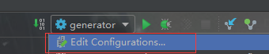
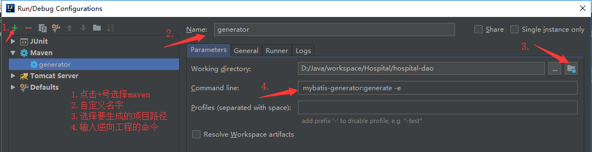

# IDEA Maven项目的Mybatis逆向工程

## 1.配置.pom

如果是在多模块开发下，该文件逆向工程要生成的那个模块下的pom文件。

```
<build>
        <plugins>
            <plugin>
                <groupId>org.mybatis.generator</groupId>
                <artifactId>mybatis-generator-maven-plugin</artifactId>
                <version>1.3.5</version>
                <configuration>
                    <verbose>true</verbose>
                    <overwrite>true</overwrite>
                </configuration>
                <dependencies>
                    <dependency>
                        <groupId>mysql</groupId>
                        <artifactId>mysql-connector-java</artifactId>
                        <version>5.1.45</version>
                    </dependency>
                </dependencies>
            </plugin>
        </plugins>
    </build>
```

## 2.在项目根目录下新建generatorConfig.xml文件

如果是在多模块开发下，该文件逆向工程要生成的那个模块下的根目录下（src\main\resourse)。

下面是官方文档提供的参考文件：

具体配置见 4.[配置文件详解]

```
<?xml version="1.0" encoding="UTF-8"?>
<!DOCTYPE generatorConfiguration
  PUBLIC "-//mybatis.org//DTD MyBatis Generator Configuration 1.0//EN"
  "http://mybatis.org/dtd/mybatis-generator-config_1_0.dtd">

<generatorConfiguration>
  <classPathEntry location="/Program Files/IBM/SQLLIB/java/db2java.zip" />

  <context id="DB2Tables" targetRuntime="MyBatis3">
    <jdbcConnection driverClass="COM.ibm.db2.jdbc.app.DB2Driver"
        connectionURL="jdbc:db2:TEST"
        userId="db2admin"
        password="db2admin">
    </jdbcConnection>

    <javaTypeResolver >
      <property name="forceBigDecimals" value="false" />
    </javaTypeResolver>

    <javaModelGenerator targetPackage="test.model" targetProject="\MBGTestProject\src">
      <property name="enableSubPackages" value="true" />
      <property name="trimStrings" value="true" />
    </javaModelGenerator>

    <sqlMapGenerator targetPackage="test.xml"  targetProject="\MBGTestProject\src">
      <property name="enableSubPackages" value="true" />
    </sqlMapGenerator>

    <javaClientGenerator type="XMLMAPPER" targetPackage="test.dao"  targetProject="\MBGTestProject\src">
      <property name="enableSubPackages" value="true" />
    </javaClientGenerator>

    <table schema="DB2ADMIN" tableName="ALLTYPES" domainObjectName="Customer" >
      <property name="useActualColumnNames" value="true"/>
      <generatedKey column="ID" sqlStatement="DB2" identity="true" />
      <columnOverride column="DATE_FIELD" property="startDate" />
      <ignoreColumn column="FRED" />
      <columnOverride column="LONG_VARCHAR_FIELD" jdbcType="VARCHAR" />
    </table>

  </context>
</generatorConfiguration>
```

## 3.运行mybatis配置文件



* 选择右上角运行按钮旁边的三角，选择Edit Configurations



1. 点击+号选择maven
2. 自定义name
3. 选择项目路径
4. 输入逆向工程的命令

## 4.注： 配置文件详解

* `<classPathEntry>`

  在pom文件中加入

  `<dependency>
  ​    <groupId>mysql</groupId>
  ​    <artifactId>mysql-connector-java</artifactId>
  ​    <version>5.1.45</version>
   </dependency>`

  依赖后可省略；

* `<context>`

  id：逆向工程的唯一标识，此值可以被应用到一些错误信息；

  targetRuntime:此属性用于指定生成的代码的运行时目标。常见值为Mybatis3，Mybatis3Simple等。

* `<jdbcConnection>`

  数据库连接信息，可参考数据库的配置文件db.properties。

* `<javaTypeResolver>`（非必须）

  该标签是用来定义java类型解析器的属性，java类型解析器是用于转换从数据库列名的类型对应的java类型。

* `<javaModelGenerator>`

  该标签决定逆向工程生成实体的位置。

  targetPackage决定生成在哪个包下，默认存放在src目录下；(com.test.entity)

  targetProject决定生成到的目标工程；（.\src\main\java）

  enableSubPackages：是否放schema作为包的后缀；（false）

  trimString：从数据库返回的值是否删除前后的空格；

* `<sqlMapGenerator>`

  生成XxxMapper.xml文件的位置，类似`<javaModelGenerator>`

  targetPackage决定生成在哪个包下;(mappers)

  targetProject决定生成到的目标工程；(.\src\main\resourse)

  enableSubPackages：是否放schema作为包的后缀；（false）

* `<javaClientGenerator>`

  生成XxxMapper接口文件的位置，类似`<javaModelGenerator>`

  targetPackage决定生成在哪个包下;(com.test.dao)

  targetProject决定生成到的目标工程；(.\src\main\java)

  enableSubPackages：是否放schema作为包的后缀；（false）

  * 注意：在配置生成实体类，mapper接口，mapper.xml配置文件的位置时，如果要生成到不同的模块中，或者有找不到文件位置时，可以采用完整路径的方式。

* `<table>`

  schema：不用填写；

  tableName：表名；

  domainObjectName：自动生成的实体文件名；

------

## 5.官方文档提供的其他功能

mybatis逆向工程在官方文档具有非常详细的解释，包括对生成文件内容的定义，可以去掉注释，取消生成mapper文件自动生成的增删改查等。

官方文档地址：[http://www.mybatis.org/generator/](http://www.mybatis.org/generator/)

* 去注释：（context下）

  是否去除所有自动生成文件的注释：

  ```
  <commentGenerator>
  	<!-- 是否去除所有自动生成的文件的时间戳：-->
  　　<property name="suppressDate" value="false"/>
  	<!-- 是否去除所有自动生成文件的注释：-->
  　　<property name="suppressAllComments" value="true"/>
  </commentGenerator>
  ```

* 去掉实体文件下的Example实体类文件。

  ```
  <table tableName="user"
          enableCountByExample="false"
          enableUpdateByExample="false"
          enableDeleteByExample="false"
          enableSelectByExample="false"
          selectByExampleQueryId="false">
  </table>
  ```

  官方文档还有很多功能，可以进入官方文档页面查看。

