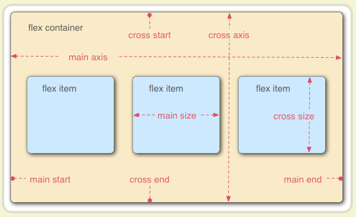
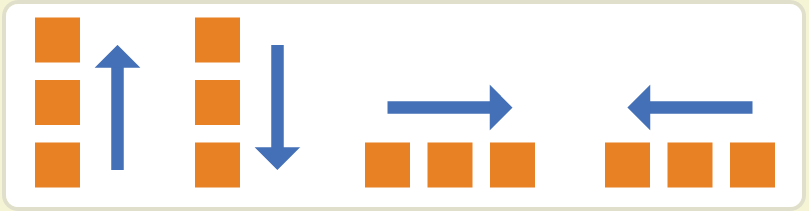
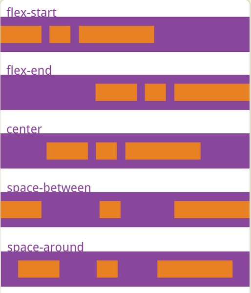
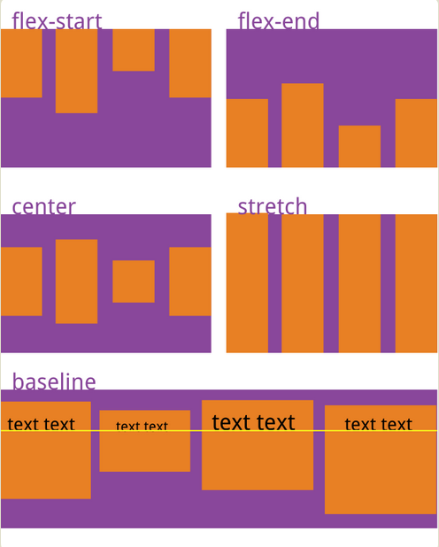
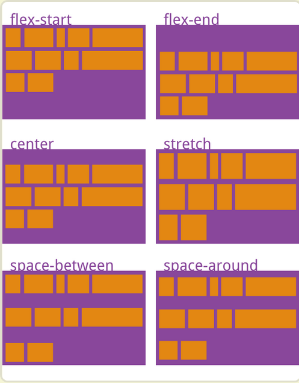
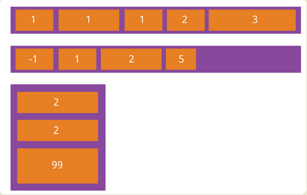
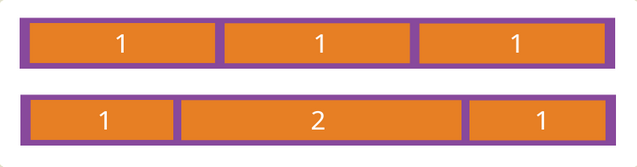
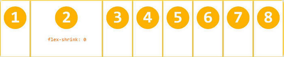
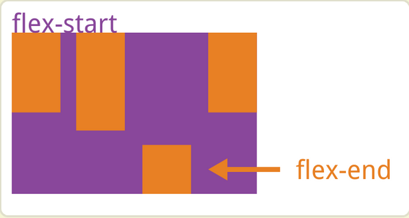

> 妄：狂妄；
>
> 不会的东西只有怀着一颗狂妄的心，假装能把它看穿吧。
>
> 作为一个什么都不会的小白，为了学习（zb），特别在拿来主义之后写一些对于某些css布局的总结，进一步加深对知识的记忆。知识是人类的共同财富，中华大地之上，皆是华夏儿女的智慧结晶。如心中也怀有拿来主义，可慢慢窃走吧，这不是偷，只是窃罢了。我们的孔大人说过的，窃书罢了，不叫偷。

## flex布局

main axis：主轴；cross axis：交叉轴

容器的子元素自动成为容器成员，成为flex 项目（item）

***

### flex容器属性

使用方法：display：flex；

#### flex-direction

​	该属性决定主轴的方向，即各flex item 的排列方向。

- row（默认值）：水平方向，起点在左端；

- row-reverse：水平方向，起点在右端；

- column：垂直方向，起点在上沿；

- column-reverse：垂直方向，起点在下沿。

  

#### flex-wrap

​	该属性决定在轴线方向排不下所有的item时的换行规则。

- nowrap（默认值）：不换行；
- wrap：换行，第一行在上方；
- wrap-reverse：换行，第一行在下方。

#### ==flex-flow==

​	该属性是flex-direction属性和flex-wrap属性的简写形式。

- 默认值：`row nowrap`；
- 属性格式：`.box { flex-flow：<flex-direction>||<flex-wrap>；}`

#### ==justify-content==

​	该属性定义了item在主轴上的对齐方式。

* flex-start（默认值）：左对齐；
* flex-end：右对齐；
* center：居中；
* space-between：两端对齐，item之间的间隔都相等；
* space-around：item两侧的间隔都相等，所以，项目之间的间隔比项目与边框的间隔大一倍。

#### align-items

​	该属性定义项目在交叉轴（cross axis）方向上如何对齐。

- flex-start：item的上边框与交叉轴的起点对齐；
- flex-end：item的下边框与交叉轴的终点对齐；
- center：item的中线与交叉轴的中点对齐；
- baseline：item的第一行文字的基线对齐（文字的底线）；
- stretch（默认值）：如果item未设置高度或设为auto，将占满整个容器的高度。

#### align-content

​	该属性定义了多条轴线的对齐方式。如果item中只有一条轴线，该属性不起作用。

+ flex-start：与交叉轴的起点对齐；
+ flex-end：与交叉轴的终点对齐
+ center：与交叉轴的中点对齐。
+ space-between：与交叉轴两端对齐，轴线之间的间隔平均分布。
+ space-around：每根轴线两侧的间隔都相等。所以，轴线之间的间隔比轴线与边框的间隔大一倍。
+ stretch（默认值）：轴线占满整个交叉轴。

### item项目属性

#### order

​	该属性决定item的排列顺序，数值越小，排列越靠前，默认为`0`。

#### ==flex-grow==

​	该属性决定item的放大比例，默认为`0`，即如果存在剩余空间，也不放大。类似Android权重（weight）

#### flex-shrink

​	该属性决定了item的缩小比例，默认为`1`，即如果空间不足，item将缩小。`负值对该属性无效`

#### flex-basis

​	该属性决定了在分配多余空间之前，item占据的主轴空间（main size）。浏览器根据这个属性，计算主轴是否有多余空间。默认值`auto`，即item的原本大小。

​	该属性可以设为`width`或`height`属性一样的值（如：35px），则item将占据固定空间。

#### flex

​	该属性是`flex-grow`，`flex-shrink`，`flex-basis`的简写。默认值为`0 1 auto`。后两个属性可选。

​	该属性有两个快捷值：`auto`：1 1 auto；`none`：0 0 auto；建议优先使用这个属性，而不是单独写三个分离的属性，因为浏览器会推算相关值。

#### align-self

​	该属性允许单个item有与其他item不一样的对齐方式，可覆盖`align-items`属性。默认值为`auto`，表示继承父元素的`align-items`属性，如果没有父元素，则等同与`stretch`。

​	该属性可能取6个值，除了auto，其他都和align-items属性完全一致。

## 边框阴影

### box-shadow

`box-shadow: <length> <length> <length>?<length>?||<color>`

 也就是

`box-shadow:inset x-offset y-offset blur-radius spread-radius color`

换句说:`box-shadow:投影方式 X轴偏移量 Y轴偏移量 阴影模糊半径 阴影扩展半径 阴影颜色`

- 投影方式：该参数为可选值，不设值时表示默认的投影方式为外阴影，如果取其唯一值`insert`，则表示投影方式为内阴影。
- x-offset（x轴偏移量）：指阴影水平偏移量，可以取正值或负值，若值为正，则阴影在对象的右边，反之在对象的左边。
- y-offset（y轴偏移量）：指阴影的垂直偏移量，可取正值或负值，若为正值，则阴影在对象的底部，反之在对象的顶部。
- blur-radius（阴影模糊半径）：可选，但取值只能为正值，值取0时，表示阴影不具有模糊效果。值越大，阴影的边缘就越模糊。
- spread-radius（阴影拓展半径）：可选，取值可以为正值或负值。若为正值，则整个阴影都延展扩大，反之缩小。
- color（阴影颜色）：可选，当不设定颜色时，浏览器会取默认色，但各浏览器的默认色不一样，特别是在webkit内核下的safari和chrome浏览器将无色，也就是透明，建议不要省略此参数。

## 圆角边框

### border-radius（css3)

​	border是一个简写属性，用于设置四个border-*-radius属性。

​	语法：`border-radius: 1-4 length|% / 1-4 length|%;`

​	按此顺序设置每个 radii 的四个值。如果省略 bottom-left，则与 top-right 相同。如果省略 bottom-right，则与 top-left 相同。如果省略 top-right，则与 top-left 相同。

> [^flex，shadow参考]: https://www.jianshu.com/p/335788e485d6，http://www.ruanyifeng.com/blog/2015/07/flex-grammar.html

[flex](http://www.ruanyifeng.com/blog/2015/07/flex-grammar.html)