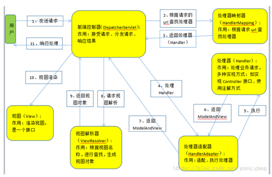

# 1    Spring  IOC容器配置

## 1.1   applicationContext.xml

### 1.1.1   配置数据源

1. 导入资源文件，db.properties

```
<context:property-placeholder location="classpath:db.properties"/>
```

2. 配置数据源，连接数据库。

```
<!-- 配置数据源 -->
<bean id="dataSource" class="org.apache.commons.dbcp.BasicDataSource" destroy-method="close">

    <property name="driverClassName" value="${jdbc.driver}"/>
    <property name="url" value="${jdbc.url}"/>
    <property name="username" value="${jdbc.username}"/>
    <property name="password" value="${jdbc.password}"/>
    <property name="maxActive" value="30"/>
    <property name="maxIdle" value="5"/>

</bean>
```

### 1.1.2   配置mybatis 的sessionFactory

Spring与Mybatis完美整合，不予要mybatis的配置映射文件

1. dataSource：配置数据源，连接数据库；

2. configLocation：配置mabatis配置文件位置，加载mybatis的配置；

3. mapperLocations：指明映射文件位置，自动扫描mapping.xml文件。

```
<!--配置sqlSessionBean-->
<bean id="sqlSessionFactory" class="org.mybatis.spring.SqlSessionFactoryBean">
    <property name="dataSource" ref="dataSource"/>
    <property name="configLocation" value="classpath:sqlMapConfig.xml"/>
    
    <!--用于指明mybatis的配置文件的位置-->
    <property name="mapperLocations" value="classpath:mappers/*.xml"/>
</bean>
```


### 1.1.3   配置声明式事务

步骤：（基于注解）

1. 配置事务管理器

```
<!-- 配置事务管理器 -->
<bean id="transactionManager"
      class="org.springframework.jdbc.datasource.DataSourceTransactionManager"
      p:dataSource-ref="dataSource"/>
```

```
<!-- 事务注解驱动，标注@Transactional的类和方法将具有事务性 -->
<tx:annotation-driven/>
```

2. 配置事务属性，需要事务管理器

<tx:advice id="txAdvice"/>

3. 配置事务切面，并把事务属性与事务切面关联起来

```
<!-- 通过AOP配置提供事务增强，让service包下所有Bean的所有方法拥有事务 -->
<aop:config proxy-target-class="true">

    <aop:pointcut id="serviceMethod"
                  expression="(execution(* zut.hospital.service..*(..))) and (@annotation(org.springframework.transaction.annotation.Transactional))"/>
    <aop:advisor pointcut-ref="serviceMethod" advice-ref="txAdvice"/>

</aop:config>
```

<!-- 配置声明式事务步骤：(基于配置文件)

​          1.配置事务管理器

​          2.配置事务属性

​          3.配置事务切面，并把事务属性与事务切面关联起来

​        

```
<bean id="transactionManager"  class="org.springframework.jdbc.datasource.DataSourceTransactionManager" 			p:dataSource-ref="dataSource"/>

<tx:advice id="txAdvice" transaction-manager=”transactionManager”/>
	<tx:attributes>
	 <tx:methods name="" propagation=""
             ...
   </tx:attributes>
</tx:advice

<aop:config>
 <aop:advisor advice-ref="txAdvice" pointcut="execution(* zut.hospital.service.*.*(..))"id="txPointCut"/>
<aop:advisor advice-ref="txAdvice" pointcut-ref="txPointCut"/>
</aop:config>
```

使用注解开发时，spring配置文件中还需要加入自动扫描包的配置，用于自动装配bean，以及自动依赖注入，@Autowired标注的参数自动装配

```
<context:component-scan base-package="zut.hospital.dao"/>                          
```

# 2    Springmvc 配置相关

## 2.1   Springmvc



1. 前端控制器：接收请求，响应结果，相当于转发器。

2. 处理器映射器HandlerMapping（不需要程序员编写）

    作用：根据请求的url查找Handler

3. 处理器适配器HandlerAdapter

    作用：按照特定规则（HandlerAdapter要求的规则）去执行Handler

4. 处理器Handler（需要程序员开发）

   注意：编写Handler要按照HandlerAdapter的要求去做，这样适配器才可以去正确执行Handler 

5. 视图解析器View resolver（不需要程序员开发）

    作用：进行视图解析，根据逻辑视图名解析成真正的视图（view）

6. 视图View（需要程序员开发 页面）

    View是一个接口，实现类支持不同的View类型（jsp，freemarker，pdf...）

## 2.2   前端控制器

作用：接收用户请求，响应结果，相当于转发器

在**web.xml**中配置，是一个servlet。

```
<servlet>

    <servlet-name>springmvc</servlet-name>
    <servlet-class>org.springframework.web.servlet.DispatcherServlet</servlet-class>
    <!-- contextConfigLocation配置springmvc加载的配置文件(配置处理器映射器，适配器)
        如果不配置，默认加载的是/WEB-INF/servlet名称-servlet.xml(springmvc-servlet.xml)-->
    <init-param>
        <param-name>contextConfigLocation</param-name>
        <param-value>classpath:spring-mvc.xml</param-value>
    </init-param>
    
    <load-on-startup>1</load-on-startup>
    <async-supported>true</async-supported>
</servlet>
```

`<init-param>`

contextConfigLocation配置springmvc加载的配置文件(配置处理器映射器，适配器)，如果不配置，默认加载的是/WEB-INF/servlet名称-servlet.xml(springmvc-servlet.xml)

```
<servlet-mapping>

    <servlet-name>springmvc</servlet-name>
    <!--  url-patten:
        1.*.action,访问以.action结尾由DispatcherServlet进行解析；
        2./，所有访问的地址都由DispatcherServlet进行解析，对于静态的文件的解析需要配置不让DispatcherServlet解析
            使用此种方法可以实现RESTful风格的url；
        3./*，不对，使用此种配置，最终要转发到一个jsp页面时，仍然会由DispatcherServlet解析jsp页面
            不能根据jsp页面找到handler，会报错。
        -->
    <url-pattern>/</url-pattern>

</servlet-mapping>
```

## 2.3   处理器映射器、处理器适配器

处理器映射器：根据请求的url查找Handler；

处理器适配器：按照特定的规则执行Handler；

```
<!-- 注解映射器 -->
<bean class="org.springframework.web.servlet.mvc.method.annotation.RequestMappingHandlerMapping"/>

<!-- 注解适配器 -->
<bean class="org.springframework.web.servlet.mvc.method.annotation.RequestMappingHandlerAdapter"/>
```

注解的映射器和适配器是配对使用的。

此外，

```
<!-- mvc注解驱动：可以代替注解映射器和适配器的配置
    mvc注解驱动默认加载了很多的参数绑定，比如默认加载json转换解析器
    如果使用该注解驱动，就不用配置注解映射器和适配器-->
<mvc:annotation-driven></mvc:annotation-driven>
```

一般开发中使用<mvc:annotation-driven>，

对标注了注解@RequestMapping(“/url”)的方法进行映射。

## 2.4   视图解析器

作用：进行视图解析，根据逻辑视图名解析成真正的视图(view)

```
<!-- 视图解析器 -->
<bean class="org.springframework.web.servlet.view.InternalResourceViewResolver"
      p:prefix="/WEB-INF/pages/"
      p:suffix=".jsp"/>
```

##  2.5  拦截器

```

```


# 3    Mybatis

## 3.1   sqlMapConfig.xml

```
<?xml version="1.0" encoding="UTF-8"?>
<!DOCTYPE configuration
        PUBLIC "-//mybatis.org//DTD Config 3.0//EN"
		"http://mybatis.org/dtd/mybatis-3-config.dtd">
<configuration>

    <settings>
        <setting name="mapUnderscoreToCamelCase" value="true"/>
    </settings>

</configuration>
```

mybatis基本配置已经在与spring整合时在applicationContext.xml中配置

详细配置见http://www.mybatis.org/mybatis-3/zh/configuration.html#